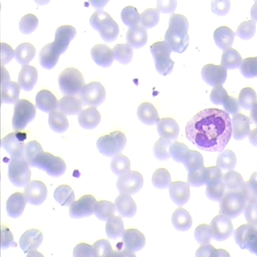
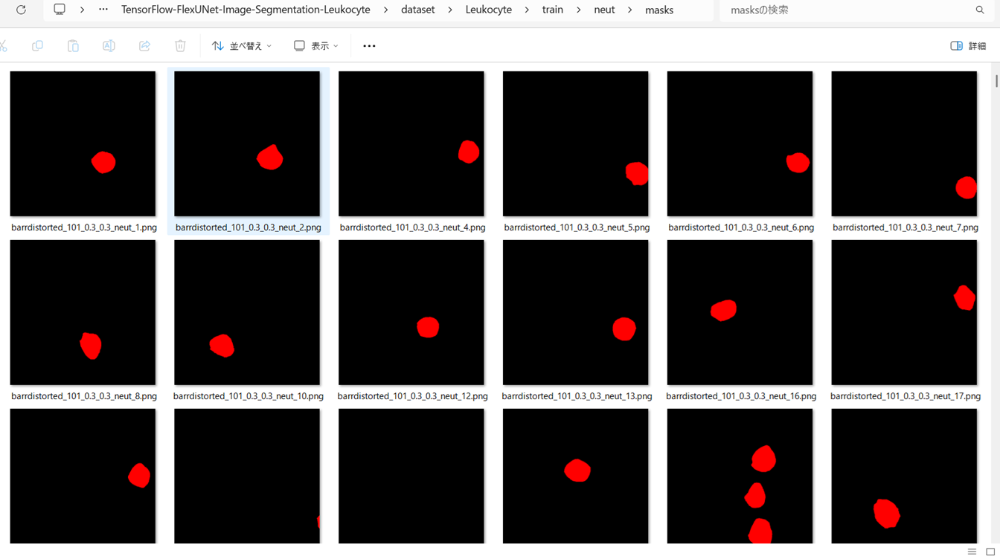
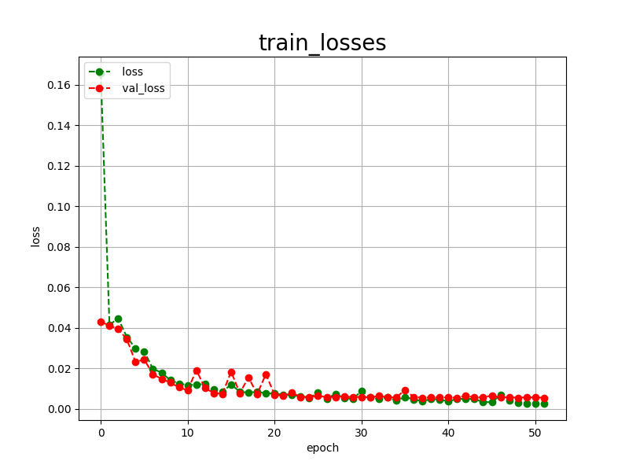

<h2>TensorFlow-FlexUNet-Image-Segmentation-Leukocyte (2025/08/15)</h2>

This is the first experiment of Image Segmentation for LISC Leukocyte Multiclass based on our 
<a href="https://github.com/sarah-antillia/TensorFlow-FlexUNet-Image-Segmentation-Model">
TensorFlowFlexUNet (TensorFlow Flexible UNet Image Segmentation Model for Multiclass) 
</a> and a 512x512 pixels 
<a href="https://drive.google.com/file/d/1QpdxGiJ9g1M-a9loKMuehnCoSEBhWx3u/view?usp=sharing">
Augmented-LISC-Leukocyte-PNG-ImageMask-Dataset.zip</a> with colorized masks
(Basophil:blue, Eosinophil:green, Lymphocyte:yellow, Monocyte:cyan, Neutrophil:red)
which was derived by us from  
<a href="https://users.cecs.anu.edu.au/~hrezatofighi/publications.htm">
LISC: Leukocyte Images for Segmentation and Classification
</a>
 
 
<b>Acutual Image Segmentation for 512x512 Leukocyte images</b> 
As shown below, the inferred masks look very similar to the ground truth masks.  
<b>rgb_map = (Basophil:blue, Eosinophil:green, Lymphocyte:yellow, Monocyte:cyan, Neutrophil:red)</b>
 
<table>
<tr>
<th>Input: image</th>
<th>Mask (ground_truth)</th>
<th>Prediction: inferred_mask</th>
</tr>
<tr>
<td></td>
<td></td>
<td></td>
</tr>
<tr>
<td></td>
<td></td>
<td></td>
</tr>
<tr>
<td></td>
<td></td>
<td></td>
</tr>
</table>

 
<h3>1. Dataset Citatioin</h3>
The orginal dataset use here has been taken from

<a href="https://users.cecs.anu.edu.au/~hrezatofighi/publications.htm"> 
LISC: Leukocyte Images for Segmentation and Classification</a>
 . Please see also the following github repository: 
<a href="https://github.com/Goblin80/Leukocyte-Classify/tree/master">
Leukocyte Images Classification
</a>
 
The following explanation has been taken from the websiste above.

<b>Introduction</b> 

The LISC database includes the hematological images taken from peripheral blood of healthy subjects. 
The database has been released to enable comparative evaluation of different techniques on nucleus and 
cytoplasm segmentation and also recognition of different white blood cells in hematological images. 
 
 <b>Data description</b> 

Samples were taken from peripheral blood of 8 normal subjects and 400 samples were obtained from 100 
microscope slides. The microscope slides were smeared and stained by Gismo-Right technique and images were 
acquired by a light microscope (Microscope-Axioskope 40) from the stained peripheral blood using an 
achromatic lens with a magnification of 100. Then, these images were recorded by a digital camera (Sony Model
No. SSCDC50AP) and were saved in the BMP format. The images contain 720x576 pixels.
 
All of them are color images and were collected from Hematology-Oncology and BMT Research Center of Imam 
Khomeini hospital in Tehran, Iran. The images were classified by a hematologist into normal leukocytes: 
basophil, eosinophil, lymphocyte, monocyte, and neutrophil. Also, the areas related to the nucleus and 
cytoplasm were manually segmented by an expert.

P.S: Manual ground truth for only 250 images, has been provided.
 
 <b>Using the database</b> 
<b>
The data included in this database can be used, free of charge, for research and educational purposes. 
Copying, redistribution, and any unauthorized commercial use are prohibited.</b>
 
The use of this database is restricted to those individuals or organizations that obtained the database 
directly from the first author website. Any researcher reporting results which use this database must acknowledge 
 the LISC database. We request you to do so by citing this publication:

Rezatofighi, S.H., Soltanian-Zadeh, H.:  
Automatic recognition of  five types of white blood cells in peripheral  
blood. Computerized Medical Imaging and Graphics 35(4) (2011) 333--343. 

 

<h3>
<a id="2">
2 Leukocyte ImageMask Dataset
</a>
</h3>
 If you would like to train this Leukocyte Segmentation model by yourself,
 please download the dataset from the google drive  
<a href="https://drive.google.com/file/d/1QpdxGiJ9g1M-a9loKMuehnCoSEBhWx3u/view?usp=sharing">
Augmented-LISC-Leukocyte-PNG-ImageMask-Dataset.zip</a>.
 
, expand the downloaded ImageMaskDataset and put it under <b>./dataset</b> folder to be
<pre>
(baso=Basophil, ensi=Eosinophil, lymp=Lymphocyte, mono=Monocyte, neut=Neutrophil)
To simpify our segmentation model, we excluded <b>mixt</b> subset in the original LISC to generate our augmented dataset.  
                        
./dataset
└─Leukocyte           (The Number of files)
    ├─test
    │  ├─baso
    │  │  ├─images     (97)
    │  │  └─masks      (97)
    │  ├─eosi
    │  │  ├─images     (71)
    │  │  └─masks      (71)
    │  ├─lymp
    │  │  ├─images     (94)
    │  │  └─masks      (94)
    │  ├─mono
    │  │  ├─images     (88)
    │  │  └─masks      (88)
    │  └─neut
    │      ├─images     (90)
    │      └─masks      (90)
    ├─train
    │  ├─baso
    │  │  ├─images    (667)
    │  │  └─masks     (667)
    │  ├─eosi
    │  │  ├─images    (491)
    │  │  └─masks     (491)
    │  ├─lymp
    │  │  ├─images    (655)
    │  │  └─masks     (655)
    │  ├─mono
    │  │  ├─images    (604)
    │  │  └─masks     (604)
    │  └─neut
    │      ├─images    (630)
    │      └─masks     (630)
    └─valid
        ├─baso
        │  ├─images    (190)
        │  └─masks     (190)
        ├─eosi
        │  ├─images    (140)
        │  └─masks     (140)
        ├─lymp
        │  ├─images    (187)
        │  └─masks     (187)
        ├─mono
        │  ├─images    (172)
        │  └─masks     (172)
        └─neut
            ├─images    (180)
            └─masks     (180)
</pre>
 

On the derivation of the augmented dataset with colorized masks, please refer to the following Python scripts: 
<li><a href="./generator/ImageMaskDatasetGenerator.py">ImageMaskDatasetGenerator.py</a></li>
<li><a href="./generator/split_master.py">split_master.py</a></li>
 
Please see also <a href="https://github.com/davidetorre92/PhD_AIMed_LISC/blob/main/PhDAIMed_Leukocytes_Segmentation_with_UNet.ipynb">
https://github.com/davidetorre92/PhD_AIMed_LISC/blob/main/PhDAIMed_Leukocytes_Segmentation_with_UNet.ipynb</a>
  in <a href="https://github.com/davidetorre92/PhD_AIMed_LISC/tree/main">PhD_AIMed_LISC</a>
  
As shown above, the number of images of train and valid datasets is not so large to use for a training set of our segmentation model.
 
 

<b>Train_Basophil_images_sample</b> 

 
<b>Train_Basophil_masks_sample</b> 

 

<b>Train_Eosinophil_images_sample</b> 

 
<b>Train_Eosinophil_masks_sample</b> 

 

<b>Train_Lymphocyte_images_sample</b> 

 
<b>Train_Lymphocyte_masks_sample</b> 

 

<b>Train_Monocyte_images_sample</b> 

 
<b>Train_Monocyte_masks_sample</b> 

 

 
<b>Train_Neutrophil_sample</b> 

 
<b>Train_Neutrophil_masks_sample</b> 

 
 

<h3>
3 Train TensorFlowFlexUNet Model
</h3>
 We trained Leukocyte TensorFlowFlexUNet Model by using the following
<a href="./projects/TensorFlowFlexUNet/Leukocyte/train_eval_infer.config"> <b>train_eval_infer.config</b></a> file.  
Please move to ./projects/TensorFlowFlexUNet/Leukocyte and run the following bat file. 
<pre>
>1.train.bat
</pre>
, which simply runs the following command. 
<pre>
>python ../../../src/TensorFlowFlexUNetTrainer.py ./train_eval_infer.config
</pre>

<b>Model parameters</b> 
Defined a small <b>base_filters = 16 </b> and large <b>base_kernels = (9,9)</b> for the first Conv Layer of Encoder Block of 
<a href="./src/TensorFlowFlexUNet.py">TensorFlowFlexUNet.py</a> 
and a large num_layers (including a bridge between Encoder and Decoder Blocks).
<pre>
[model]
;You may specify your own UNet class derived from our TensorFlowFlexModel
model         = "TensorFlowFlexUNet"
generator     =  False
image_width    = 512
image_height   = 512
image_channels = 3
num_classes    = 6

base_filters   = 16
base_kernels   = (9,9)
num_layers     = 8
dropout_rate   = 0.05
dilation       = (1,1)
</pre>
<b>Learning rate</b> 
Defined a very small learning rate.  
<pre>
[model]
learning_rate  = 0.00007
</pre>
<b>Loss and metrics functions</b> 
Specified "categorical_crossentropy" and <a href="./src/dice_coef_multiclass.py">"dice_coef_multiclass"</a>. 
<pre>
[model]
loss           = "categorical_crossentropy"
metrics        = ["dice_coef_multiclass"]
</pre>
<b>Dataset class</b> 
Specifed <a href="./src/ImageCategorizedMaskDataset.py">ImageCategorizedMaskDataset</a> class. 
<pre>
[dataset]
class_name    = "ImageCategorizedMaskDataset"
</pre>
 
<b>Learning rate reducer callback</b> 
Enabled learing_rate_reducer callback, and a small reducer_patience.
<pre> 
[train]
learning_rate_reducer = True
reducer_factor     = 0.5
reducer_patience   = 4
</pre>
<b>Early stopping callback</b> 
Enabled early stopping callback with patience parameter.
<pre>
[train]
patience      = 10
</pre>

<b>RGB Color map</b> 
rgb color map dict for Leukocyte 1+4 classes. 
<pre>
[mask]
mask_file_format = ".png"
; 1+5 classes
; RGB colors        baso:blue,    eosi:green,  lymp: yellow,   mono:cyan,      neut:red
rgb_map = {(0,0,0):0,(0,0,255):1,(0, 255,0):2 ,(255,255,0):3, (0, 255,255):4, (255, 0,0):5}
</pre>

<b>Epoch change inference callback</b> 
Enabled <a href="./src/EpochChangeInfereuncer.py">epoch_change_infer callback</a></b>. 
<pre>
[train]
epoch_change_infer       = True
epoch_change_infer_dir   =  "./epoch_change_infer"
num_infer_images         = 6
</pre>

By using this callback, on every epoch_change, the inference procedure can be called
 for 6 images in <b>mini_test</b> folder. This will help you confirm how the predicted mask changes 
 at each epoch during your training process.    

<b>Epoch_change_inference output at starting (epoch 1,2,3)</b> 
 
 
<b>Epoch_change_inference output at middlepoint (epoch 21,22,23)</b> 
 
 
<b>Epoch_change_inference output at ending (epoch 50,51,52)</b> 
 
 
In this experiment, the training process was stopped at epoch 52 by EarlyStopping callback.  
 
 

<a href="./projects/TensorFlowFlexUNet/Leukocyte/eval/train_metrics.csv">train_metrics.csv</a> 
 

 
<a href="./projects/TensorFlowFlexUNet/Leukocyte/eval/train_losses.csv">train_losses.csv</a> 
 

 

<h3>
4 Evaluation
</h3>
Please move to <b>./projects/TensorFlowFlexUNet/Leukocyte</b> folder, 
and run the following bat file to evaluate TensorFlowFlexUNet model for Leukocyte. 
<pre>
./2.evaluate.bat
</pre>
This bat file simply runs the following command.
<pre>
python ../../../src/TensorFlowFlexUNetEvaluator.py ./train_eval_infer_aug.config
</pre>

Evaluation console output: 

  

<a href="./projects/TensorFlowFlexUNet/Leukocyte/evaluation.csv">evaluation.csv</a> 
The loss (categorical_crossentropy) to this Leukocyte/test was very low and dice_coef_multiclass 
very high as shown below.
 
<pre>
categorical_crossentropy,0.0058
dice_coef_multiclass,0.9974
</pre>
 

<h3>
5 Inference
</h3>
Please move <b>./projects/TensorFlowFlexUNet/Leukocyte</b> folder 
,and run the following bat file to infer segmentation regions for images by the Trained-TensorFlowFlexUNet model for Leukocyte. 
<pre>
./3.infer.bat
</pre>
This simply runs the following command.
<pre>
python ../../../src/TensorFlowFlexUNetInferencer.py ./train_eval_infer_aug.config
</pre>

<b>mini_test_images</b> 
 
<b>mini_test_mask(ground_truth)</b> 
 

<b>Inferred test masks</b> 
 
 

<b>Enlarged images and masks of 512x512 pixels</b> 

<table>
<tr>
<th>Image</th>
<th>Mask (ground_truth)</th>
<th>Inferred-mask</th>
</tr>

<tr>
<td></td>
<td></td>
<td></td>
</tr>

<tr>
<td></td>
<td></td>
<td></td>
</tr>

<tr>
<td></td>
<td></td>
<td></td>
</tr>

<tr>
<td></td>
<td></td>
<td></td>
</tr>

<tr>
<td></td>
<td></td>
<td></td>
</tr>

<tr>
<td></td>
<td></td>
<td></td>
</tr>
</table>

 
<h3>
References
</h3>
<b>1. Leukocyte Images Classification</b> 
Mahmoud Goblin80 
<a href="https://github.com/Goblin80/Leukocyte-Classify/tree/master">
https://github.com/Goblin80/Leukocyte-Classify/tree/master
</a> 
<a href="https://mahmoudkhld.dev/blog/leukocyte-images-classification/">Leukocyte Images Classification</a>
 
 

<b>2. Deep learning-based image annotation for leukocyte segmentation and classification of blood cell morphology</b> 
Vatsala Anand, Sheifali Gupta, Deepika Koundal, Wael Y. Alghamdi & Bayan M. Alsharbi  
<a href="https://bmcmedimaging.biomedcentral.com/articles/10.1186/s12880-024-01254-z">
https://bmcmedimaging.biomedcentral.com/articles/10.1186/s12880-024-01254-z
</a>
 
 

<b>3. TensorFlow-FlexUNet-Image-Segmentation-KRD-WBC-White-Blood-Cell</b>
  
Toshiyuki Arai antillia.com 
<a href="https://github.com/sarah-antillia/TensorFlow-FlexUNet-Image-Segmentation-KRD-WBC-White-Blood-Cell">
https://github.com/sarah-antillia/TensorFlow-FlexUNet-Image-Segmentation-KRD-WBC-White-Blood-Cell
</a>

